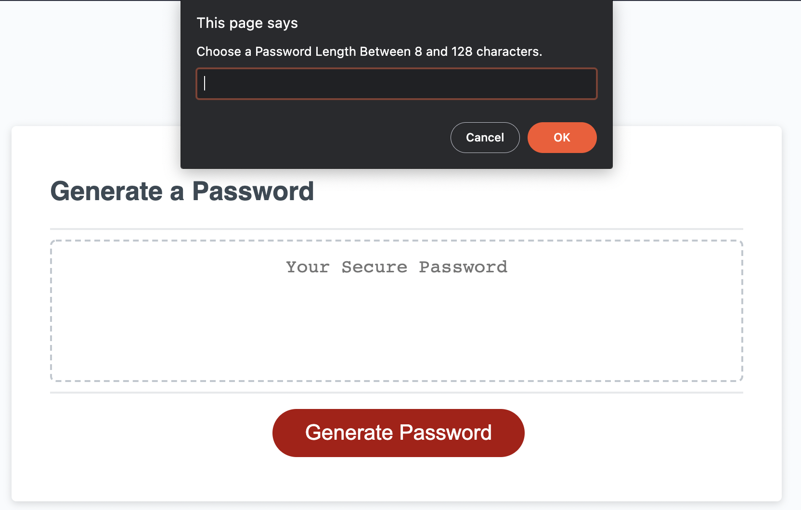

# Password Generator

## Description

- This application is a tool to generate a secure password. 
- The application functions by taking user inputs and compiling a password based on those inputs. 
- This application was writting in Javascript. 

## How To Use

- Select a length between 8 and 128 characters and input in the initial prompt that opens when clicking generate password. 
- Follow the proceeding prompts that ask for password parameters. Make sure you choose at least one. 
- Password will generate and populate within the text box. 

## Screenshot of Application
